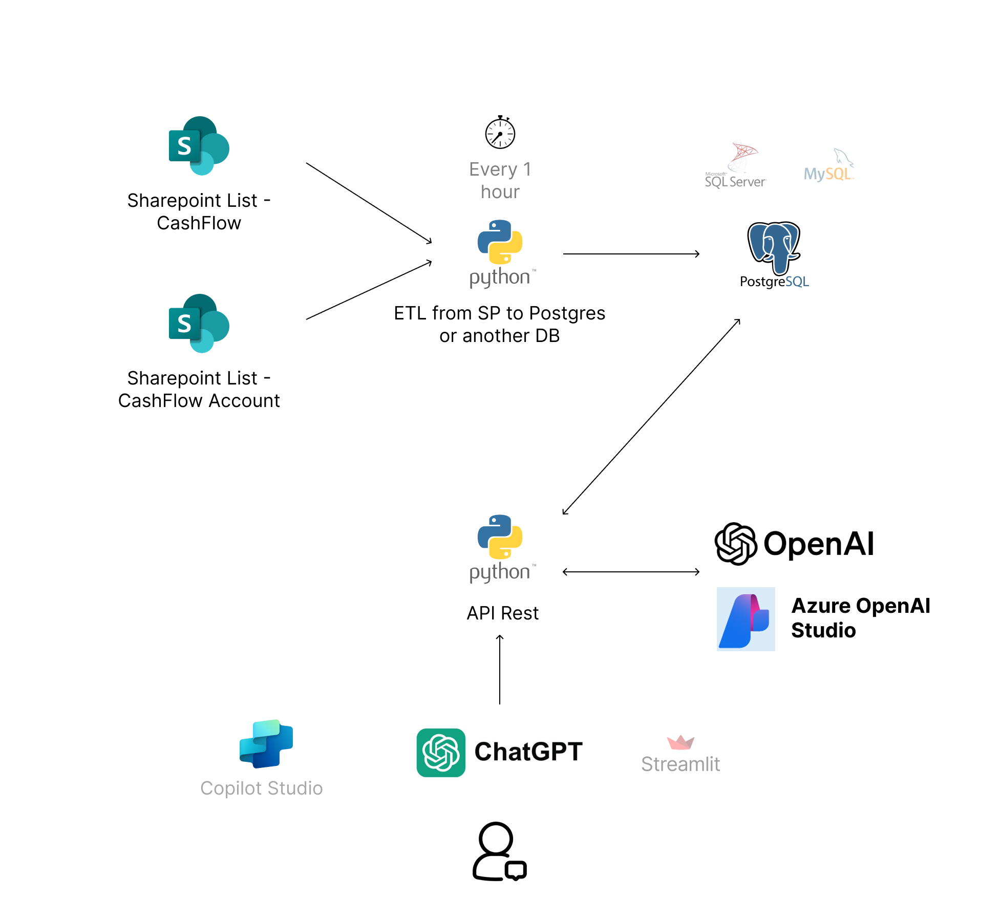
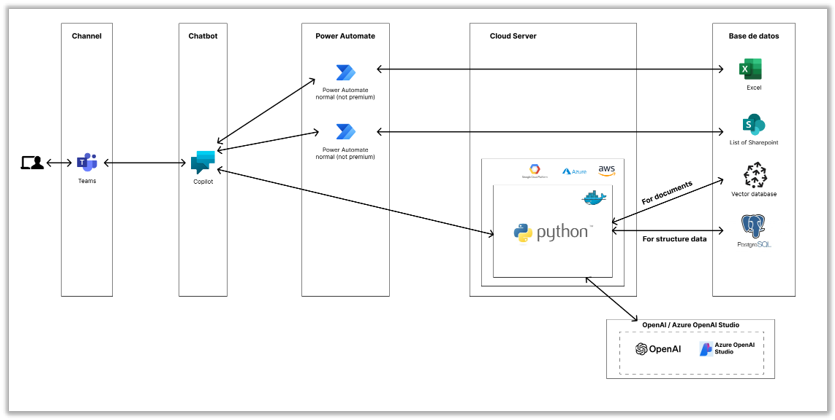

# CHATBOT (Microsoft Copilot Studio/ChatGPT | Sharepoint | Postgres)

This is a small example of how we can chat with structure data. Currently the best way to work with SP is send the data to a SQL database.

## Server Architecture

## Copilot Integration

## Demo

https://youtu.be/iq2T0v9VxRo (ES)

